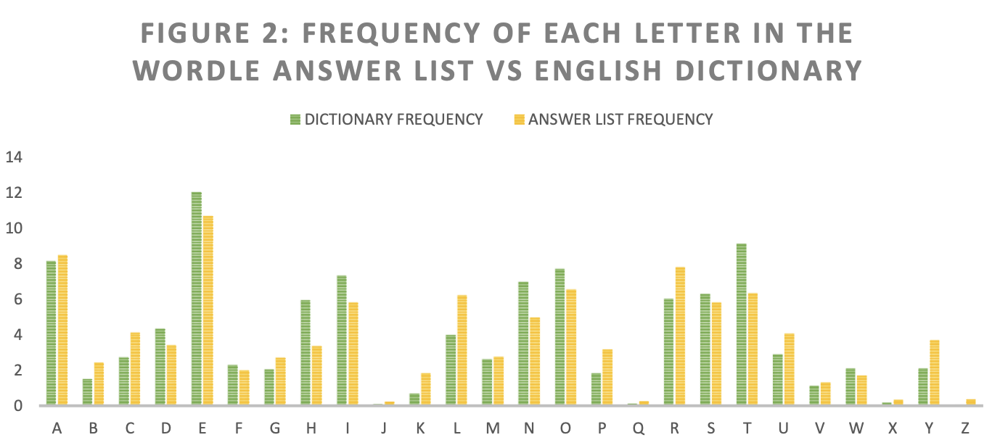
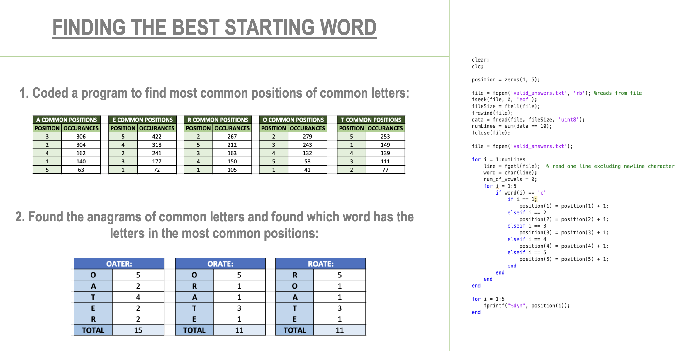

# Wordle Analysis

For my data analysis project for my Grand Challenges in Computer Science University Course, I decided to investigate and create data around the New York Times puzzle game, Wordle. I used Matlab and Excel to find the best starting word, most common letters, the best second guess, the worst starting word, and more.

Two data sets were accessed to achieve the results. The main data sets used are lists of all words in the Wordle answer and guesses lists, created by Lucas Hohman in 2022. The other data set I used was a list of the frequency of all letters in the alphabet in the English dictionary, created in 2004 by the Cornell Department of Mathematics.

The experimental setup was created using Excel. Matlab was used to analyse and condense the 2309 rows of data, which was then copied into an Excel file, where tables and graphics were created. The data is organised neatly, and the graphs are colour coded and labelled effectively.

